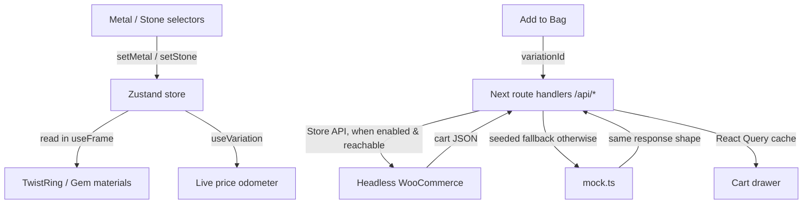

# Aurelle Configurator — Architecture & Data Flow

How the experience hangs together: the 3D scene, the 2D interface, shared state,
and the WooCommerce-or-mock backend behind a single set of route handlers.

## Three synced layers

1. **The 3D scene** — `@react-three/fiber` + `drei` + `@react-three/postprocessing`.
   One fixed, full-page `<Canvas>` (`three/Scene.tsx`) renders the ring for the
   whole site. Loaded via `next/dynamic({ ssr:false })` so WebGL only ever spins
   up on the client (no SSR hydration crash).
2. **The 2D interface** — Next.js App Router + Tailwind + Framer Motion + Lenis.
3. **Shared state** — a single Zustand store (`store/configurator.ts`).

The 3D scene and the DOM never talk directly; they both read the store.

## Data flow: interaction → cart

### 1. Live 3D updates
A click calls `setMetal(id)` / `setStone(id)`. `TwistRing` and `Gem` read the
store and **interpolate** material colour/roughness and stone geometry inside
`useFrame` — the core geometry is never remounted, so changes are smooth and the
ring can never blink out. (A duplicate-`varying` shader bug that previously made
the band render with a failed material — i.e. invisible — was fixed here.)

### 2. The scroll "stage" director
`Scene.tsx` keeps the camera calm. Rather than flying it through the page, the
ring group is placed in a deterministic on-screen **stage** chosen by scroll
zone, measured from real section anchors (`#ring`, `#finale`):

- **Hero** — right column on desktop, top on mobile.
- **Atelier / Materials** — right-side stage on wide screens (copy held to a left
  column); the ring steps aside (fades) on narrow/mobile so it never overlaps text.
- **Finale** — centred, sized to leave clear bands above/below for the copy.

This is what guarantees the ring and the typography never collide, and it honours
`prefers-reduced-motion` (instant transitions, no bloom, no idle spin).

### 3. WooCommerce integration — the Store API (no keys)
`lib/woo.ts` is a **server-only** client for the WooCommerce **Store API**
(`wc/store/v1`), chosen over the legacy REST v3 deliberately: it is the
purpose-built headless surface for products, prices and cart, using cookie/cart
tokens instead of an OAuth 1.0a consumer key/secret — so there is no secret to
leak to the browser. Every call is server-side and bounded by a short timeout.

- `/api/products` fetches the variable ("composite") product and hydrates each
  metal × stone variation's price.
- `/api/cart` (POST) adds the matched `variationId`; the cart token is stored in
  an httpOnly cookie.

### 4. Seeded fallback
When `WOOCOMMERCE_ENABLED` is not `true` or the store is unreachable (e.g. a
Vercel preview with no backend), the route handlers return data from
`lib/mock.ts` in the **same response shape**, priced from the same source of
truth (`lib/config.ts`) the Docker seeder uses. The UI labels this honestly
("Seeded demo") and disables checkout rather than faking an order.

## Source of truth
`lib/config.ts` defines metals, stones, base price and premiums. The mock, the UI
and the WooCommerce seeder (`docker/seed.php`) all derive from it, so the live
store and the demo agree to the dollar.

## Motion layer
- **Lenis** — eased desktop scroll (off for touch and reduced-motion).
- **Magnetic** — interactive elements lean toward the cursor.
- **SplitText / Reveal** — mask-based editorial type reveals.
- **PriceTag** — a digit-odometer that rolls on configuration change.
- **Bloom + Vignette** — a restrained post pass (desktop) so the diamond sparkles
  and the frame settles into the dark; disabled under reduced-motion.
